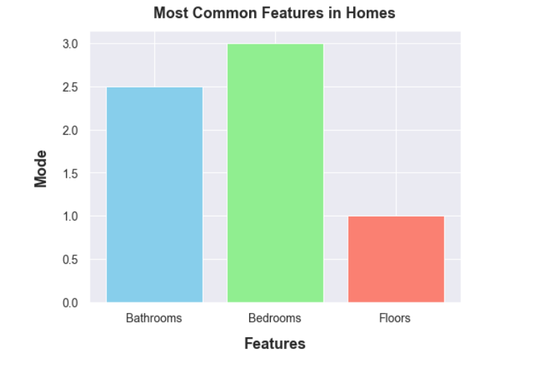

# House Sales in Northwestern County

#### Authors:
1. ABIGAEL NYABAGA
2. BEDAN CHEGE
3. BERYL AGAI
4. BRIAN MUTHAMA
5. FARHIYA JARSO
6. IAN KIPTOO
7. JACKSON MUNENE
8. KELSEY MAINA
 
### kanban board link
> **Link:**[https://moringaprojectss.atlassian.net/jira/software/projects/SCRUM/boards/1?atlOrigin=eyJpIjoiOGRkNjRiMTA0ZmU3NGZiNzliY2JiYzZiMGFmMjgyZTciLCJwIjoiaiJ9]()

## Business Understanding.
### 1.1 Overview
The real estate industry is one of the thriving industries as people have come to appreciate and understand its role in acquiring your dream home.We have been tasked with the role of analysing the given datasets to come up with an analysis of house sales in the northwestern county. This information will be very useful to:the real estate agency,home owners,potential investors and potential customers.The challenges that may have led to this project include: inadequate information about housing in this county and misinformed speculations about this region that are not supported by data.
>**Objectives**
The key objectives for this analysis are as follows;
The key objectives for this analysis are as follows;
>* Predicting home prices: To create a predictive model that estimates increase in market value of home based on renovation factors.
>* Identifying the most important features: To review which renovation variables have the highest impact on increasing estimated value of a home.We investigated how adding: *additional bathroom,an extension to the living space in the home,an additional bedroom and extension to the lot in the home* have an impact on change in house prices.
>* Monitoring real estate market trends: Real estate trends are used by investors to help them decide where and when to make investments by learning more about the regions with the highest and lowest average sale price as well as the most in-demand property types.
## DATA UNDERSTANDING
The research retrieves information from King County House Sales dataset which contains the $kc_house_data.csv$ file used to forecast the sales price of homes in King County.It comprises of 21,597 housing observations and 20 house features along with a column indicating the home id. The data covers homes sold between May 2014 and May 2015 **`Key variables:`**price, bedrooms,bathrooms, sqft living, sqft_lot.
**`Target Variable`:** The `"price"` of the properties is the project's target variable. 
## Data Cleaning
we identified outliers in our dataset using boxplots and we removed the neccesary outliers.
we also identified the missing values in our dataset and eliminated them accordingly.For the waterfall feature we replaced the null values with "UNVERIFIED".This is because this feature had a high value count and we considered it a significant feature in our data analysis.For the view feature we opted to drop it since it had a low value count and was not considered significant in our analysis.For the year renovated,we droped the feature as it was not a significant feature in our analysis.
We then checked for duplicate values and there is no appearance of duplicate values in our data.
### EDA
We compared the number of bathrooms, bedrooms, and floors in the dataset with the aimed to provide insights into the typical configuration of homes in the area.The visualization below provides a clear comparison of the most common configurations of these features in the dataset.

The analysis reveals that the majority of homes in the dataset have at least 3 bedrooms, 2 bathrooms, and 1 floor.
We then did a correlation to identify which features have the highest correlation to price.This helped us identify the factors affecting the price of houses.

We analized the price trends of house sales over the months.Notably, February records the lowest average price, contrasting with April, which demonstrates the highest.This will inform the house buyers on the correct time to buy a home.

### Data modeling
To build our predictive model, we carried out a simple and multiple linear regression. We then did linear regression on our model using the logtransformation model.
### Results and Conclusion
The project developed a regression model predicting home values based on factors like square footage, bedrooms, and bathrooms. It offers insights for buyers and brokers seeking precise price estimates. Bedrooms, bathrooms, and living space significantly impact prices, with larger homes commanding higher values. Property condition, amenities, and market trends are crucial considerations. Continuous model refinement enhances accuracy. Bathrooms positively affect prices, while larger living areas increase value and lot size decreases it. Multi-story homes fetch higher prices, guiding pricing and marketing strategies.
In summary, this endeavor effectively constructed a regression algorithm aimed at forecasting house values, leveraging diverse attributes including bedroom and bathroom counts, square footage, age, and location. The model demonstrated commendable precision in estimating house prices and shed light on the influential factors affecting housing costs. Such insights can prove invaluable to both real estate professionals and prospective buyers seeking precise assessments of property values based on their specifications.
### link to presentation
> **Link:**[/Presentation%20pdf.pdf]()